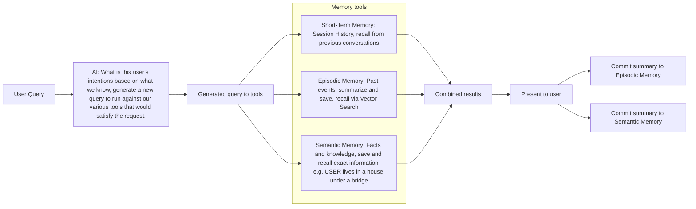

# Memory systems and query flow

Inspired by the Rosston Agentic Memory System [https://www.rosston.dev/blog/groundhog-day]()

This document describes how user queries are interpreted and answered using three memory systems (Short-Term, Episodic, and Semantic), and how responses are written back to long-term memory.

